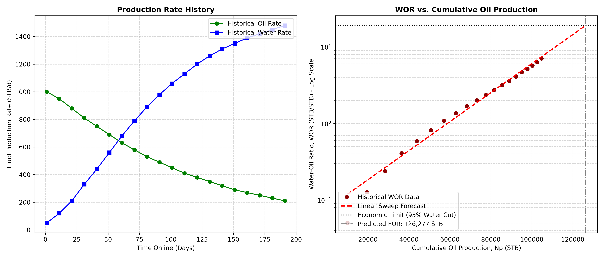

# Automated Decline Curve Analysis (DCA) & Water Sweep Diagnostics

## Project Overview
This tool is designed to automate well performance evaluations by integrating classic Production Decline Curve Analysis (Arps) with Reservoir Sweep Diagnostics (Water-Oil Ratio extrapolation). By cross-verifying oil decline trends against physical surface water handling limits, this workflow provides a more robust and realistic estimate of Estimated Ultimate Recovery (EUR) than standalone mathematical regressions.

## Core Engineering Methodology
* **Boundary-Dominated Flow (BDF) Filtering:** The algorithm automatically isolates early-time transient flow and removes operational anomalies (such as well shut-ins or workovers) to ensure Arps equations are strictly applied during boundary-dominated flow.
* **Physical Parameter Constraints:** The Arps hyperbolic exponent ($b$) is strictly bounded between $0.01$ and $0.99$ to conform to conventional matrix drive physics, preventing unphysical mathematical over-optimism.
* **Water Cut & Conformance Analytics:** The tool fits a linear regression to the $\log(WOR)$ vs. $N_p$ relationship. It extrapolates this trend to a user-defined surface facility economic limit (e.g., 95% Water Cut) to verify if water handling capacities choke the well before it hits its decline-based economic limit.

## Standard Oilfield Units Used
* **Rates:** Stock Tank Barrels per day (STB/d)
* **Volumes:** Stock Tank Barrels (STB)
* **Ratios:** Water-Oil Ratio (STB/STB)

## Key Visualizations
Below is the diagnostic dashboard generated by the script, showcasing the production rate history alongside the semi-log WOR sweep extrapolation line:

## Expected Outputs
The tool generates a command-line engineering audit report specifying:
* Initial Production Rate ($q_i$) in STB/d
* Nominal Decline Rate ($D_i$) %/day
* Arps Decline Exponent ($b$)
* Predicted EUR (STB) based on both decline curves and water limits.